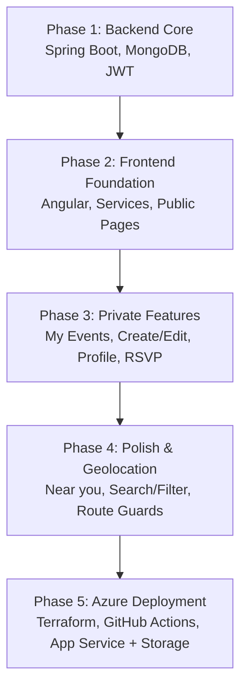
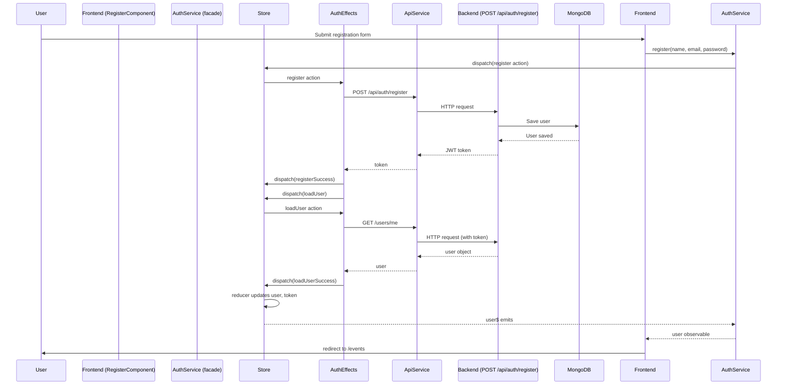
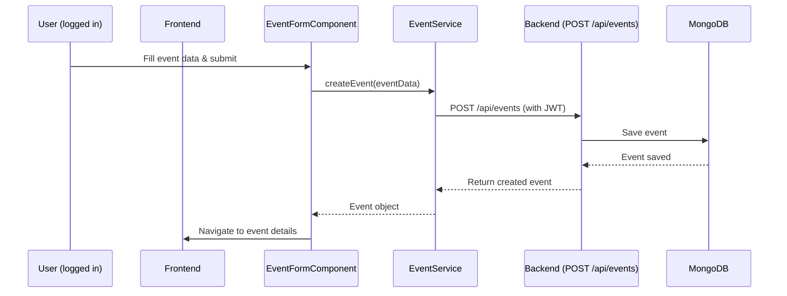
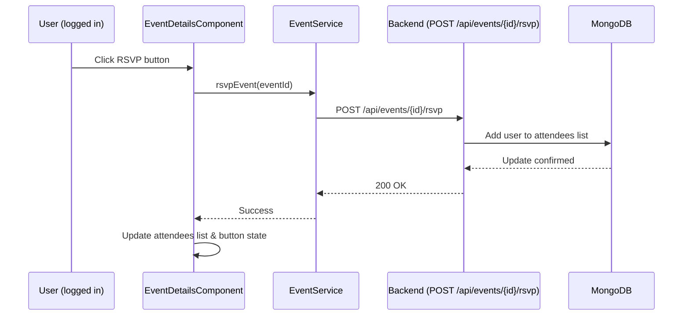
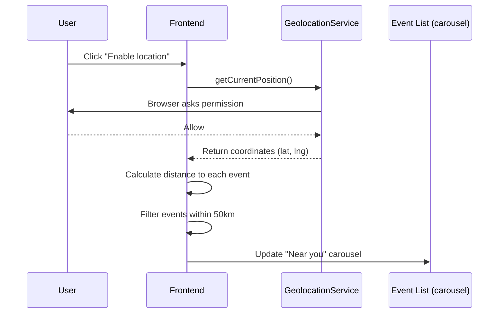
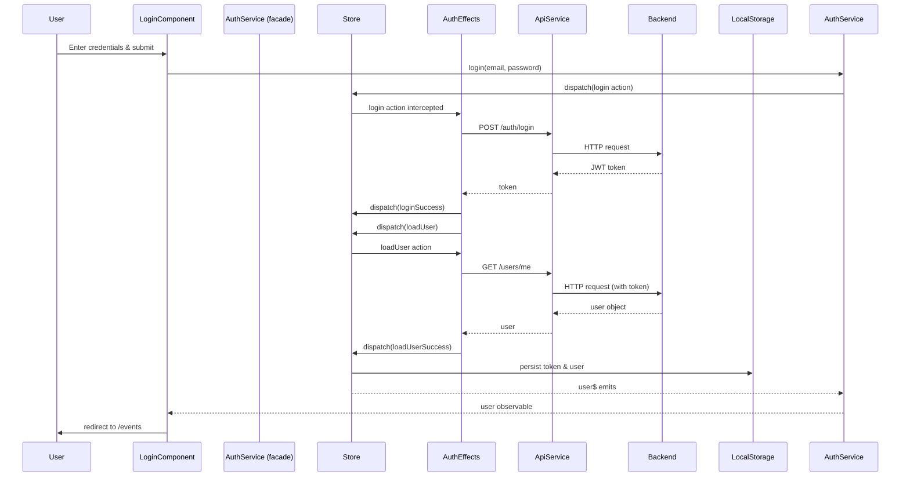

# EventHub Development Roadmap
---

## Documentation

- [Backend README](./backend/README.md)
- [Frontend README](./frontend/README.md)
---

## Project Overview

EventHub is a full‑stack web application for discovering and managing local events.
- **Backend**: Spring Boot 3.2, MongoDB Atlas, JWT authentication
- **Frontend**: Angular 17+ standalone, RxJS, responsive CSS
- **Deployment**: Azure App Service (backend) + Azure Storage static website (frontend)
---

## Technology Stack

| Layer     | Technology                                                                    |
|-----------|-------------------------------------------------------------------------------|
| Backend   | Java 17+, Spring Boot 3.2.x, Spring Data MongoDB, Spring Security, JWT, Maven |
| Frontend  | Angular 17+ (standalone), TypeScript, RxJS, Angular CLI, CSS (custom)         |
| Database  | MongoDB Atlas (or local MongoDB)                                              |
| Container | Docker + Docker Compose (optional)                                            |
| CI/CD     | GitHub Actions (backend JAR deployment)                                       |
| Hosting   | Azure App Service (backend), Azure Storage (frontend)                         |
---

## Development Phases

- [Project Board](https://github.com/users/hiiico/projects/14)


---

## Sequence Diagrams

### User Registration (with NgRx)

What changed:

- `AuthService` now dispatches an action instead of calling the API directly.
- NgRx Effects handle the API call, success/failure actions, and the subsequent `loadUser` call.
- Store manages the state (user, token) and notifies the component via selectors.
- The final navigation is triggered by the component reacting to the `user$` observable (or a success action).

The same pattern applies to the Login, Register, Logout and Profile flows.



### Create Event (without NgRx)



### RSVP to Event (without NgRx)



### Geolocation “Near you” (without NgRx)


---

## Running the Full Stack Locally

1. **Backend** (port 3000):  
```bash
cd backend && ./mvnw spring-boot:run -Dspring-boot.run.profiles=dev
```

2. **Frontend** (port 4200):  
```bash
cd frontend && ng serve
```

3. **Open** [http://localhost:4200](http://localhost:4200)

### Running with Docker (from pre‑built images)

If you have the images available on Docker Hub, you can run the entire stack with a single command:

```bash
docker-compose up -d
```

To pull the images first and then run:

```bash
docker pull hiiico/eventhub-backend:latest
docker pull hiiico/eventhub-frontend:latest
docker-compose up -d
```

To run only the backend or frontend separately:

```bash
docker run -p 3000:3000 --env-file .env hiiico/eventhub-backend:latest
```
```bash
docker run -p 4200:80 hiiico/eventhub-frontend:latest
```

> Note: The backend requires the .env file with MongoDB Atlas credentials. The frontend is a static nginx container serving the Angular app.
---

## Deployment to Azure

The repository is configured for automatic deployment via GitHub Actions on push to `main`.
- Backend: `AZURE_WEBAPP_PUBLISH_PROFILE` secret required
- Frontend: `AZURE_STORAGE_KEY` secret required

Infrastructure can be provisioned with Terraform (see `terraform/` folder).  
After deployment:
- Backend: [https://eventhub-backend.azurewebsites.net](https://eventhub-backend.azurewebsites.net)
- Frontend: [https://eventhubfrontend.z28.web.core.windows.net](https://eventhubfrontend.z28.web.core.windows.net)
---

## Completed Improvements

### ✅ NgRx State Management for Authentication

The authentication module now uses NgRx for predictable state management, side effect handling, and better scalability.

- **State**: user, token, loading, error, updateSuccess
- **Actions**: login, register, logout, updateUser, loadUser, clearError
- **Effects**: handle API calls, token storage, navigation, auto‑clear success message
- **Selectors**: user$, isAuthenticated$, loading$, error$, updateSuccess$
- **Facade**: `AuthService` wraps the store, keeping components decoupled

#### Sequence Diagram – NgRx Authentication Flow (Login)



The same pattern applies to `register`, `logout`, and `updateUser`. All components (`Header`, `Profile`, `Login`, `Register`) have been refactored to use the NgRx‑backed `AuthService` facade.

---
## Future Improvements (Bonuses)
- ~~Add NgRx for state management~~ (✅ Completed for authentication)
- Extend NgRx to Events, RSVP, and Geolocation modules
- Add unit test coverage for NgRx effects and reducers
- Implement Google Drive API for event flyers
- Use Azure Front Door for global load balancing

---