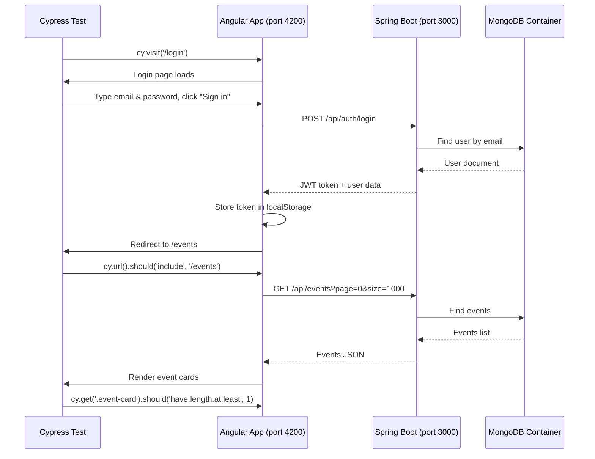

#### Full‑Stack Event Management Application

---

## Documentation
- [Project Board](https://github.com/users/hiiico/projects/14)
- [Backend](./backend/README.md)
- [Frontend](./frontend/README.md)
- [Development](DEVELOPMENT_ROADMAP.md)

---

## Technology Stack

| Layer     | Technology                                                                    |
|-----------|-------------------------------------------------------------------------------|
| Backend   | Java 17+, Spring Boot 3.2.x, Spring Data MongoDB, Spring Security, JWT, Maven |
| Frontend  | Angular 17+ (standalone), TypeScript, RxJS, Angular CLI, CSS (custom)         |
| Database  | MongoDB Atlas (or local MongoDB)                                              |
| Container | Docker + Docker Compose                                                       |
| CI/CD     | GitHub Actions (backend JAR deployment)                                       |
| Hosting   | Azure App Service (backend), Azure Storage (frontend)                         |

---

## Getting Started

### Quick Start commands

#### MongoDB instance running locally:

```bash
docker run -d -p 27017:27017 --name mongodb-local mongo:7
```

#### Backend:

> Option A: Create `backend/src/main/resources/application-dev.properties`
```properties
spring.data.mongodb.uri=mongodb://localhost:27017/eventhub_dev
jwt.secret=mySecretKeyForJWTGenerationShouldBeLongEnough12345
```

>Option B: Use environment variables

```bash
export SPRING_DATA_MONGODB_URI=mongodb://localhost:27017/eventhub_dev
export JWT_SECRET=mySecretKeyForJWTGenerationShouldBeLongEnough12345
```

Then run

```bash
./mvnw spring-boot:run -Dspring-boot.run.profiles=dev
```
The API will be available at [http://localhost:3000](http://localhost:3000).

- Backend detailed setup in [backend/README.md](backend/README.md#running-locally).

#### Frontend:

```bash
cd frontend
npm install
npm start
```
The API will be available at [http://localhost:4200](http://localhost:4200).

- Frontend detailed setup in [frontend/README.md](frontend/README.md#running-locally).

---

### 1. Try the deployed app (no setup required)

The backend is already running on Azure, and the frontend is hosted as a static website.  
👉 [**EventHub Live Demo**](https://eventhubfrontend.z28.web.core.windows.net)

> You can browse events, but to create events or RSVP you need to register an account – it’s completely free.

---

### 2. Fork the repo and run locally (full development mode)

```bash
./local-dev.sh
```

The script will:

- Create a persistent MongoDB container (data survives restarts)

- Launch the backend on port 3000 with the dev profile

- Launch the frontend on port 4200 with live reload

- Press `Ctrl+C` to stop – the MongoDB container stops automatically (data is kept for next run).

> Requirements: Docker, Java 17, Maven, Node.js 20, Angular CLI.

---

### 3. Pull pre‑built Docker images and run (no build required)

If you just want to run the application without building anything, use the images from Docker Hub.

```bash
# Pull the images
docker pull hiiico/eventhub-backend:latest
docker pull hiiico/eventhub-frontend:latest

# Run the backend (requires a MongoDB instance – see note below)
docker run -d -p 3000:3000 --name eventhub-backend hiiico/eventhub-backend:latest

# Run the frontend
docker run -d -p 4200:80 --name eventhub-frontend hiiico/eventhub-frontend:latest
```

> Note: The pre‑built backend expects a MongoDB connection string via the environment variable SPRING_DATA_MONGODB_URI. For a quick test, you can start a local MongoDB container: 
```bash
docker run -d -p 27017:27017 --name mongodb mongo:7
docker run -d -p 3000:3000 --name eventhub-backend --link mongodb -e SPRING_DATA_MONGODB_URI=mongodb://mongodb:27017/eventhub hiiico/eventhub-backend:latest
```

---

### 4. Build and run everything with Docker Compose (full local stack)

This option builds the images from source and runs a complete local environment with a MongoDB container, backend, and frontend – all isolated.

```bash
# Clone the repository
git clone https://github.com/hiiico/Event_Hub
cd eventhub

# (Optional) Create a .env file for JWT secret
echo "JWT_SECRET=mySuperSecretKey" > .env

# Build and start all services
docker-compose up --build

# Stop and remove containers (including the database volume)
docker-compose down -v
```

- Frontend: http://localhost:4200

- Backend API: http://localhost:3000

- MongoDB: internal mongodb://mongodb:27017/eventhub

> The frontend is built with `API_URL=http://localhost:3000/api`, so your browser talks directly to the backend container via the host‑mapped port.

---

## Testing

- [Backend](backend/README.md#running-tests)

- [Frontend](frontend/README.md#running-tests)

### Running E2E Tests (Full Stack)

The project also includes an end‑to‑end test script that starts a disposable MongoDB container, builds and runs the backend, serves the frontend, executes all Cypress tests, and cleans up everything afterward.

```bash
./run-e2e-tests.sh
```

#### What the script does automatically:

- 🐳 Installs Docker (if missing – works on Ubuntu/Debian)
- 🔄 Starts the Docker daemon (if not already running)
- 🗄️ Creates a fresh MongoDB container named mongodb-e2e (replica set enabled)
- 🔧 Builds the backend (mvn clean package -DskipTests) and starts it on port 3000 with the e2e profile
- 🌐 Starts the Angular frontend (ng serve) on port 4200
- ⏳ Waits for both services to become responsive
- 🧪 Runs all Cypress E2E tests from frontend/cypress/e2e/
- 🧹 Stops the backend, frontend, and removes the MongoDB container (no leftovers)

Login E2E Test – Sequence Diagram



All E2E tests run against a real MongoDB instance and a fully functional backend + frontend, ensuring maximum reliability.

> Note: The script assumes a Linux environment (Ubuntu/Debian) for Docker installation. On macOS or Windows, install Docker Desktop manually; the script will still manage the container lifecycle.
The backend is expected to run on port 3000 and the frontend on port 4200. Adjust the script if your setup uses different ports.

If you prefer to run Cypress tests against an already running backend (e.g., your development backend), you can execute the tests directly:

```bash
ng serve   # in one terminal
# In another terminal:
npx cypress open   # interactive mode
# or
npx cypress run    # headless mode
```

Make sure the backend is running and the environment variables (API URL) are correctly configured (e.g., in `src/environments/environment.ts`).

---