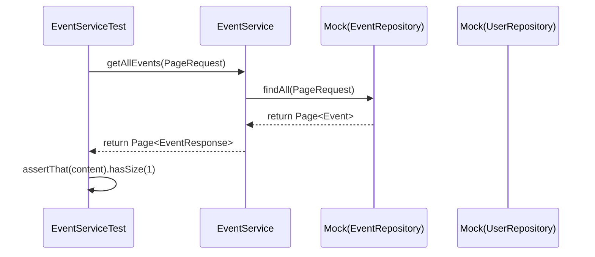
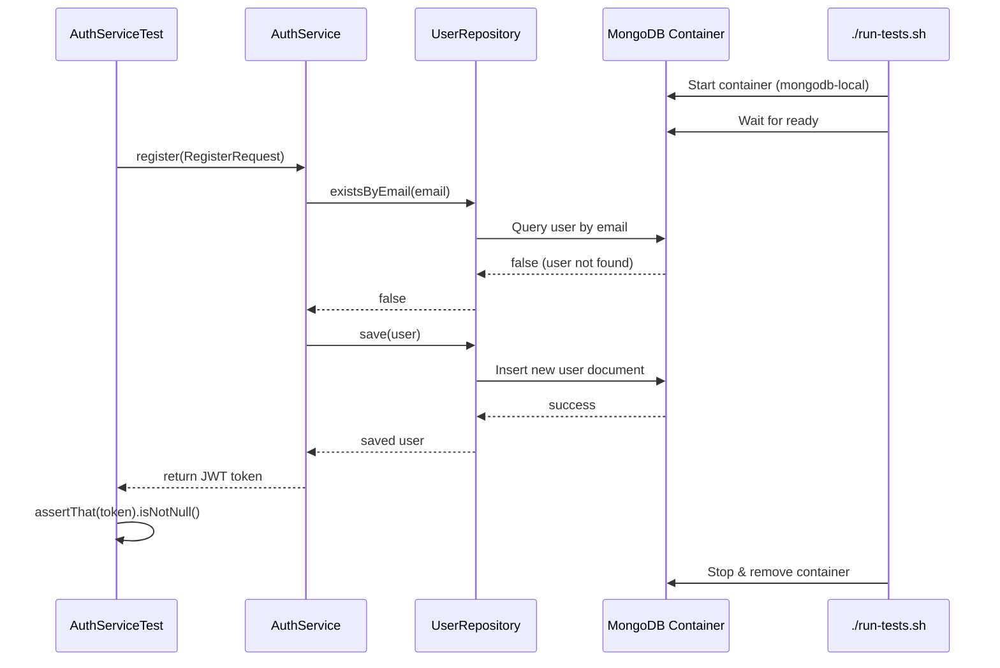

# EventHub Backend

 Spring Boot REST API for EventHub – event discovery, RSVP, comments, and JWT authentication.

---

## Tech Stack
- Java 17
- Spring Boot 3.2.3
- Spring Data MongoDB
- Spring Security (JWT)
- Maven
- MongoDB Atlas

---

## Project Structure

```
backend/
├── pom.xml
├── src/
│ └── main/
│ ├── java/com/eventhub/
│ │ ├── EventHubApplication.java
│ │ ├── controller/
│ │ │ ├── AuthController.java
│ │ │ ├── EventController.java
│ │ │ └── HealthController.java
│ │ ├── dto/ # Request/response DTOs
│ │ ├── model/ # MongoDB documents (User, Event, Comment)
│ │ ├── repository/ # Spring Data MongoDB repositories
│ │ ├── security/ # JWT, SecurityConfig, filters
│ │ └── service/ # Business logic
│ └── resources/
│ └── application.properties
```

---

## Running Locally

### Prerequisites
- Java 17, Maven
- MongoDB Atlas account (or local MongoDB)

### Configuration

Create `src/main/resources/application-dev.properties` (do not commit) with:

```properties
spring.data.mongodb.uri=mongodb+srv://<username>:<password>@<cluster>.mongodb.net/?appName=<app>
jwt.secret=<your-secret>
```

Or set environment variables: `MONGODB_USERNAME`, `MONGODB_PASSWORD`, `JWT_SECRET`.

### Run
```bash
./mvnw spring-boot:run -Dspring-boot.run.profiles=dev
```
The API will be available at [http://localhost:3000](http://localhost:3000).

---

## Running Tests

### Unit / Integration Tests (Maven)

The project includes an automated test script that sets up a clean MongoDB container, runs all tests, and cleans up afterward.

#### Linux / macOS (with Docker)

```bash
./run-tests.sh
```

This script does the following automatically:

✅ Installs Docker (if missing – works on Ubuntu/Debian)

✅ Starts the Docker daemon (if not already running)

✅ Creates and starts a MongoDB container named mongodb-local (or reuses an existing one)

✅ Waits for MongoDB to become ready

✅ Executes mvn clean test

✅ Stops the MongoDB container after the tests finish

All tests (unit, integration, and repository) run against a real MongoDB instance, ensuring maximum reliability.

#### Unit Test Example – `EventService.getAllEvents` (with Mockito)



> Note: The script assumes a Linux environment (Ubuntu/Debian) for Docker installation. For macOS or Windows, please install Docker Desktop manually and then run the script – it will still manage the container lifecycle.

#### Integration Test Example – `AuthService` (with real MongoDB `inside the disposable container`)



### e2e Tests (Cypress)

The frontend uses [Cypress](https://www.cypress.io/) for end‑to‑end testing. The full stack E2E tests (including backend and database) are orchestrated from the project root:

```bash
cd ../   # go to project root
./run-e2e-tests.sh
```

This script automatically starts a disposable MongoDB container, builds and runs the backend, serves the frontend, executes all Cypress tests, and cleans up afterward.

If you prefer to run Cypress tests against an already running backend (e.g., your development backend), you can execute the tests directly:

```bash
ng serve   # in one terminal
# In another terminal:
npx cypress open   # interactive mode
# or
npx cypress run    # headless mode
```

Make sure the backend is running and the environment variables (API URL) are correctly configured (e.g., in `src/environments/environment.ts`).

---

## Backend API Endpoints

| Method | Endpoint                     | Description                             | Auth Required |
|--------|------------------------------|-----------------------------------------|:-------------:|
| GET    | `/`                          | Health check – returns OK               |      No       |
| POST   | `/api/auth/register`         | Register a new user                     |      No       |
| POST   | `/api/auth/login`            | Login – returns JWT token               |      No       |
| GET    | `/api/events`                | List all events (paginated)             |      No       |
| GET    | `/api/events/{id}`           | Get event details                       |      No       |
| POST   | `/api/events`                | Create a new event                      |      Yes      |
| PUT    | `/api/events/{id}`           | Update an event (owner only)            |      Yes      |
| DELETE | `/api/events/{id}`           | Delete an event (owner only)            |      Yes      |
| POST   | `/api/events/{id}/rsvp`      | Toggle RSVP status                      |      Yes      |
| POST   | `/api/events/{id}/comments`  | Add a comment to an event               |      Yes      |
| GET    | `/api/events/user/created`   | Events created by the logged‑in user    |      Yes      |
| GET    | `/api/events/user/attending` | Events the logged‑in user is attending  |      Yes      |
| GET    | `/api/users/me`              | Get current user profile                |      Yes      |
| PUT    | `/api/users/me`              | Update user profile (name, email)       |      Yes      |

---

## Environment Variables

| Variable                | Description                    |    Default     |
|-------------------------|--------------------------------|:--------------:|
| SPRING_DATA_MONGODB_URI | Full MongoDB connection string |       -        |
| MONGODB_USERNAME        | MongoDB Atlas username         |       -        |
| MONGODB_PASSWORD        | MongoDB Atlas password         |       -        |
| JWT_SECRET              | JWT signing secret             | mySecretKey... |
| WEBSITES_PORT           | Azure App Service port         |      3000      |

---

## Deployment to Azure

The backend is deployed as a JAR to Azure App Service via GitHub Actions.
Set the environment variables in the App Service configuration.

### Health Check

Endpoints `/` and `/robots933456.txt` return `OK` to satisfy Azure health probes.

---