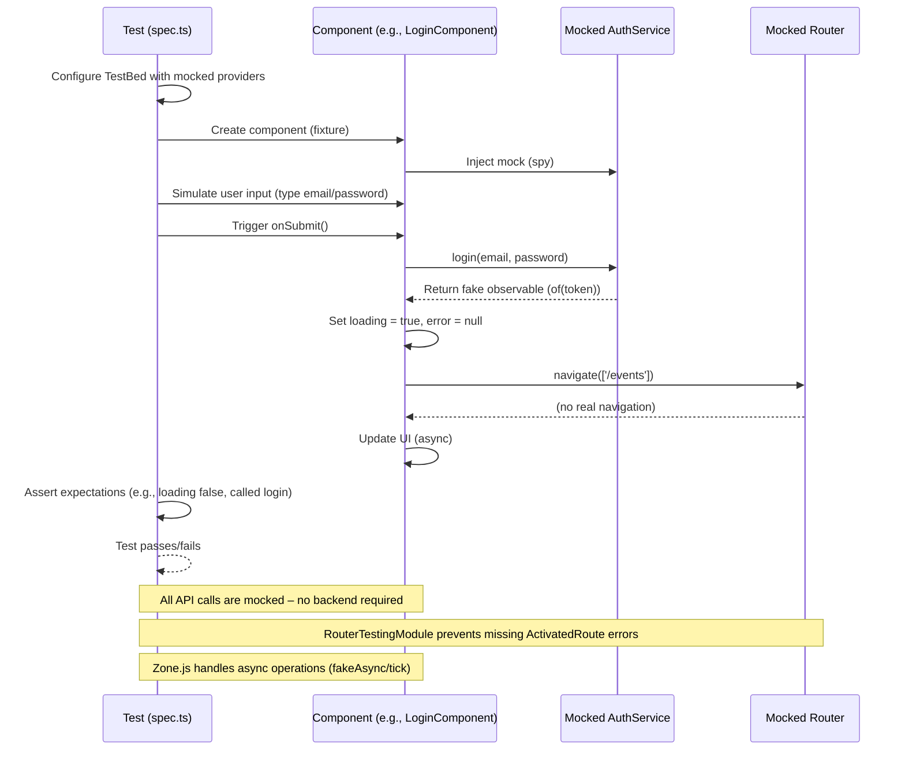

# EventHub – Frontend

Angular 17+ standalone application for EventHub – discover events, RSVP, create events, and manage profile.

---

## Tech Stack
- Angular 17+ (standalone components)
- TypeScript, RxJS
- CSS (custom, responsive)
- Font Awesome 6

---

## Project Structure

```
src/app/
├── core/ # Guards, interceptors, services (auth, event, geolocation)
├── shared/ # Models, reusable components (event-card, comment-section, event-form, event-search, location-picker)
├── features/ # Feature modules (home, about, event-catalog, event-details, event-create, event-edit, login, register, profile, my-events)
├── app.config.ts
├── app.routes.ts
└── app.component.ts
```

---

## Running Locally

### Prerequisites
- Node.js 20+
- Angular CLI (`npm install -g @angular/cli`)

### Install dependencies

```bash
npm install
```

### Development server

```bash
ng serve
```

Navigate to [http://localhost:4200](http://localhost:4200). The application will automatically reload on code change

### Build for production

```bash
ng build --prod
```

The output is in `dist/frontend/browser/`.

---

##  Running Tests

This project uses [Jasmine](https://jasmine.github.io/) as the testing framework and [Karma](https://karma-runner.github.io/) as the test runner.

### Running unit tests

```bash
ng test
```

- Karma will launch a Chrome browser instance and execute all `*.spec.ts` files.

- The tests run in watch mode by default – they will automatically re-run when you modify a source or test file.

- To run the tests once and exit (useful for CI), set `singleRun: true` in `karma.conf.js`.

### Important notes
- No backend required – all API calls are mocked using Jasmine spies.

- Zone.js is loaded automatically – the configuration ensures `fakeAsync` and `waitForAsync` work correctly.

- RouterLink components are tested with `RouterTestingModule` to avoid missing ActivatedRoute providers.

#### Example (`LoginComponent` calling `AuthService`)



- The test sets up the TestBed with mocked providers (e.g., AuthService, Router).
- The component is created and injected with the mocks.
- The test simulates user actions (filling a form, clicking a button) and triggers the component’s method.
- The component calls the mocked service (which returns a fake observable – no real HTTP request).
- The component then navigates (via mocked Router) and updates its internal state.
- The test verifies expectations (e.g., that login was called, that loading flags changed, etc.).
- Zone.js ensures that asynchronous operations (observables, promises) are handled correctly.

#### For more details, see the [Angular testing guide](https://angular.dev/guide/testing).

### Running e2e Tests (Cypress)

The frontend uses [Cypress](https://www.cypress.io/) for end‑to‑end testing. The full stack E2E tests (including backend and database) are orchestrated from the project root:

```bash
cd ../   # go to project root
./run-e2e-tests.sh
```

This script automatically starts a disposable MongoDB container, builds and runs the backend, serves the frontend, executes all Cypress tests, and cleans up afterward.

If you prefer to run Cypress tests against an already running backend (e.g., your development backend), you can execute the tests directly:

```bash
ng serve   # in one terminal
# In another terminal:
npx cypress open   # interactive mode
# or
npx cypress run    # headless mode
```

Make sure the backend is running and the environment variables (API URL) are correctly configured (e.g., in `src/environments/environment.ts`).

---

## Environment Configuration

| File                                 | API URL                                                       |
|--------------------------------------|---------------------------------------------------------------|
| src/environments/environment.ts      | `http://localhost:3000/api` (development)                     |
| src/environments/environment.prod.ts | `https://eventhub-backend.azurewebsites.net/api` (production) |

---

## Features
- Public pages: Home, About, event catalog, event details, login, register
- Private pages (require authentication): My events (created + attending), create/edit event, profile
- RSVP – toggle attendance on event details page
- Comments – add comments to events (authenticated)
- Geolocation – “Near you” carousel (within 50km)
- Search/filter – by title/location, category, date (date picker in hero)
- Responsive – works on mobile, tablet, desktop

---

## Docker

You can run the frontend as a standalone container from Docker Hub.

### Pull from Docker Hub

```bash
docker pull hiiico/eventhub-frontend:latest
```

### Run the container

```bash
docker run -p 4200:80 hiiico/eventhub-frontend:latest
```

> The frontend container serves the Angular app via nginx. All client‑side routing (e.g., `/events`) works because nginx is configured to fall back to `index.html`.

---

## Frontend Routes

| Path               | Component               |      Guard      | Description                                       |
|--------------------|-------------------------|:---------------:|---------------------------------------------------|
| `/`                | `HomeComponent`         |        –        | Landing page with hero, features, featured events |
| `/about`           | `AboutComponent`        |        –        | Information about the platform                    |
| `/events`          | `EventCatalogComponent` |        –        | Event catalog with search, filters, carousels     |
| `/events/:id`      | `EventDetailsComponent` |        –        | Detailed view of a single event                   |
| `/login`           | `LoginComponent`        | `loggedInGuard` | Login form (redirects if already logged in)       |
| `/register`        | `RegisterComponent`     | `loggedInGuard` | Registration form (redirects if logged in)        |
| `/my-events`       | `MyEventsComponent`     |   `authGuard`   | User dashboard – created and attending events     |
| `/events/create`   | `EventCreateComponent`  |   `authGuard`   | Form to create a new event                        |
| `/events/edit/:id` | `EventEditComponent`    |   `authGuard`   | Form to edit an existing event (owner only)       |
| `/profile`         | `ProfileComponent`      |   `authGuard`   | User profile settings (name, email)               |
| `**` (wildcard)    | –                       |        –        | Redirects to `/home` (404 fallback)               |

### Guards:

- `loggedInGuard` – prevents authenticated users from accessing login/register (redirects to `/events`).
- `authGuard` – prevents unauthenticated users from accessing private pages (redirects to `/login`).

> All frontend routes are handled by Angular’s Router and are served by the static website (Azure Storage). The backend only serves the API endpoints and the health check (`/`).

---
